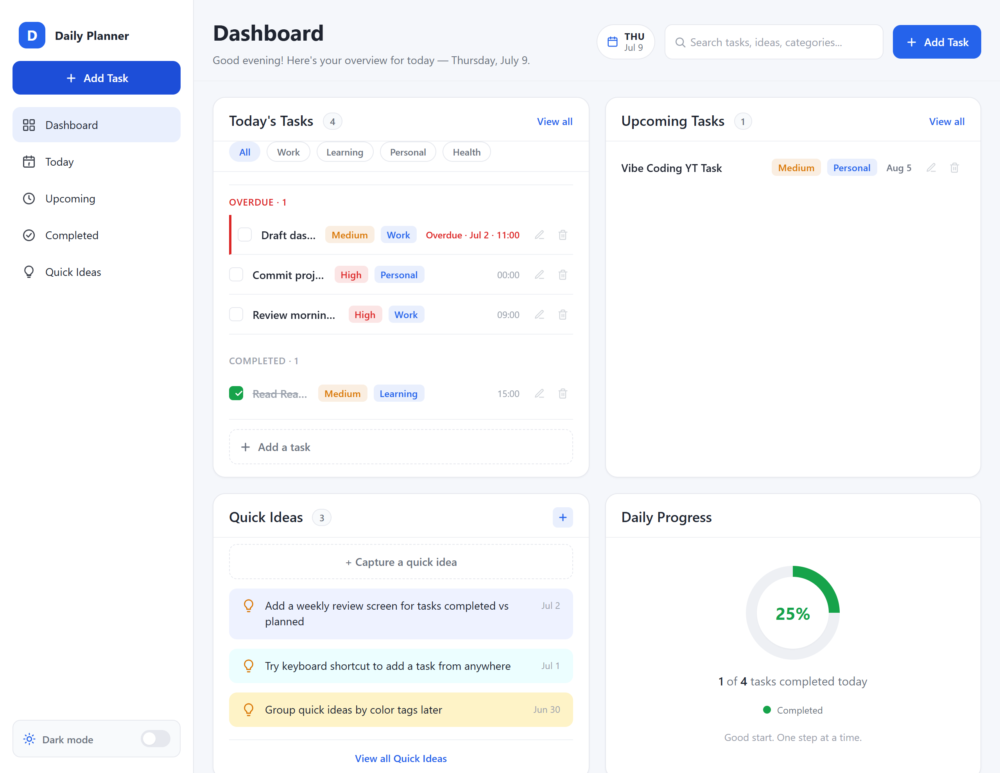
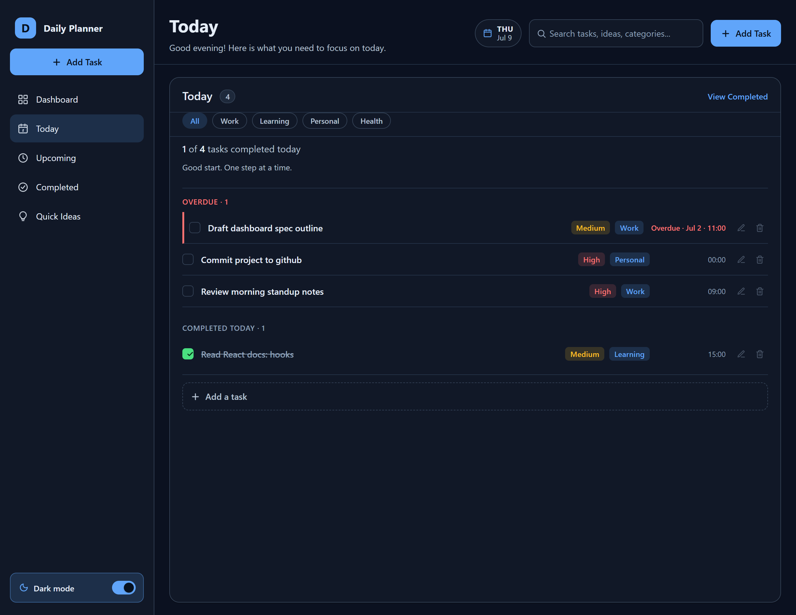
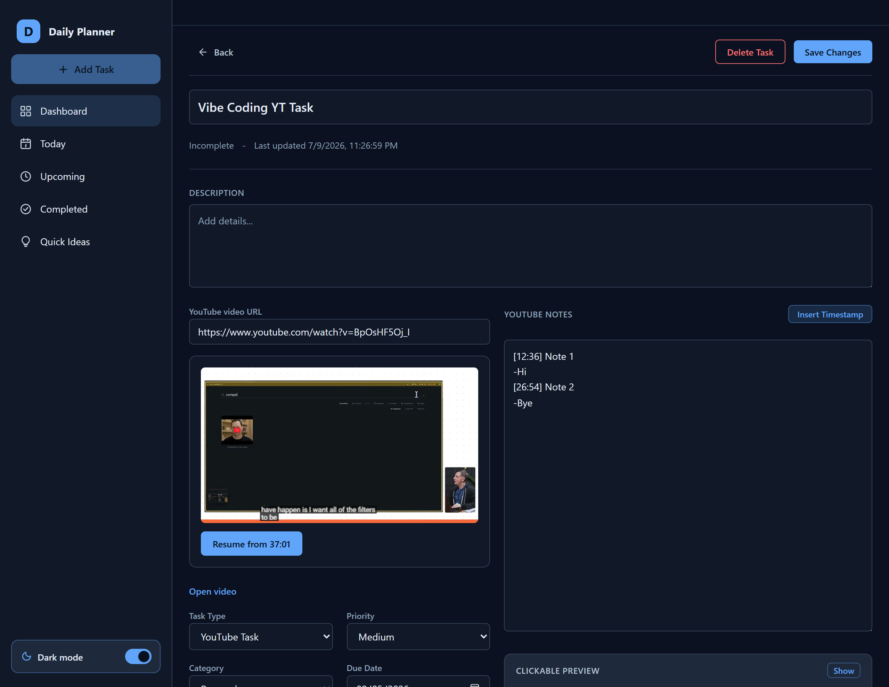
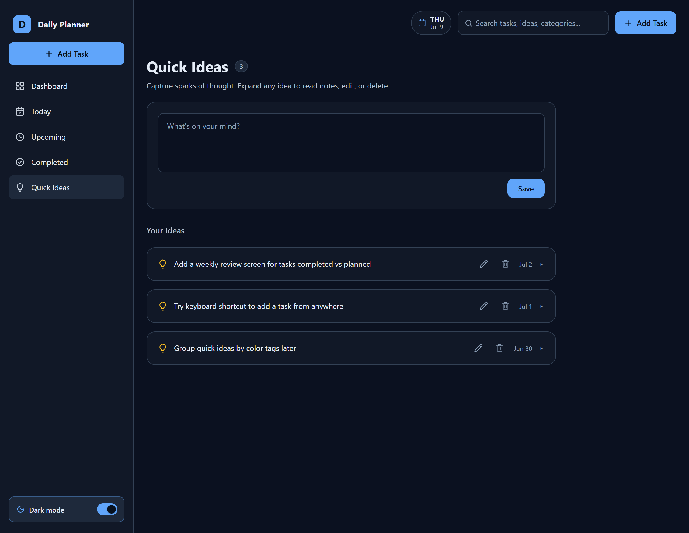

# Daily Planner

A responsive productivity application for organizing tasks, capturing Quick
Ideas, and taking timestamped notes while watching YouTube videos.

Daily Planner has two separately deployed editions:

- **v1 localStorage edition:** https://daily-planner-olive-zeta.vercel.app
  stays browser-local, requires no account, and remains on
  `release/v1-local`.
- **v2 cloud edition:** https://daily-planner-v2-seven.vercel.app uses
  Google Authentication and per-account Cloud Firestore sync. Its accepted
  release SHA is `cc7222bf480b4be9703cd19bc9ce0d2c00cbb086` on `main`.

Release verification is complete; final release approval is still pending.



---

## Key Features

- **Dashboard** — Today's tasks, upcoming tasks, Quick Ideas, and a live
  daily progress ring on one screen.
- **Dedicated workspaces** — Today, Upcoming, Completed, and Quick Ideas
  reachable from the sidebar.
- **Global Add Task modal** — Create a task from any normal workspace with optional
  priority, category, time, and due date.
- **Task management** — Edit, complete, uncomplete, and delete tasks with
  confirmation; automatic sorting by overdue, time, and due date.
- **Overdue and completed states** — Overdue tasks rise to the top with a
  warning; completed groups can be expanded or collapsed where applicable.
- **Standard and YouTube task types** — Standard tasks for general work,
  YouTube tasks for learning from video content.
- **Embedded YouTube playback** — Watch videos inside the app without
  navigating away.
- **Saved playback position and resume** — Continue from where you left
  off after a refresh.
- **Timestamped notes** — Insert plain-text `[M:SS]` tokens into notes
  while watching.
- **Clickable timestamp preview** — Rendered preview chips seek and play
  the embedded player at the marked time.
- **Quick Ideas** — Capture ideas instantly with title editing, notes,
  and deletion.
- **Workspace persistence** — Your last normal workspace is restored
  after refresh.
- **Responsive layout** — Works on desktop and mobile widths.
- **Light and dark theme** — Persistent theme preference.
- **Keyboard accessibility** — Keyboard-accessible controls with visible
  focus indicators.
- **localStorage persistence** — Every change is saved automatically to
  the browser.

### Screenshots

**Today (dark mode)** — Filtering, task metadata, overdue tasks, and
completed task groups.



**YouTube Task Detail (dark mode)** — Embedded playback, resume position,
timestamped notes, and clickable preview.



**Quick Ideas (dark mode)** — Idea capture and idea management.



---

## Technology Stack

| Layer | Choice |
|---|---|
| Framework | React |
| Build tool | Vite |
| Language | JavaScript |
| Styling | Regular CSS (no Tailwind, no CSS modules) |
| Data | v1: browser `localStorage`; v2: Firebase Authentication + Cloud Firestore |
| Linting | ESLint |

The v2 edition uses Google Authentication only and owner-isolated Firestore
data. No custom backend, Firebase Hosting, Functions, Storage, billing
account, routing library, or external data API is used. The YouTube IFrame
Player API is loaded by the browser for in-app video embedding and playback
controls.

---

## Local Setup

```bash
# clone the repository
git clone https://github.com/MazharulKhan/daily-planner.git
cd daily-planner

# install dependencies
npm install

# start the dev server
npm run dev
```

Open the URL shown in your terminal (usually `http://localhost:5173`).

### Firebase configuration and emulators

Copy `.env.example` to an untracked `.env` and set only these names from the
Firebase project you are intentionally targeting:

```text
VITE_FIREBASE_API_KEY
VITE_FIREBASE_AUTH_DOMAIN
VITE_FIREBASE_PROJECT_ID
VITE_FIREBASE_APP_ID
VITE_USE_FIREBASE_EMULATORS
```

Never commit real values. For local Auth and Firestore emulators, use a
`demo-` project ID with `VITE_USE_FIREBASE_EMULATORS=true`, then run:

```bash
npm run emulators
```

Emulator accounts may be local test identities. Deployed v2 uses real Google
accounts. Vercel Preview maps to Development Firebase (`daily-planner-mk-dev`)
and Vercel Production maps to Production Firebase (`daily-planner-mk-prod`).

---

## Available npm Commands

| Command | Description |
|---|---|
| `npm run dev` | Start the Vite development server |
| `npm run build` | Create a production build |
| `npm run preview` | Preview the production build locally |
| `npm run lint` | Run ESLint |
| `npm run emulators` | Start local Auth and Firestore emulators |
| `npm run test:rules` | Run Firestore Rules, converter, task, and idea cloud tests in the emulator |

---

## Data Storage, Security, and Limitations

- **v1:** tasks and ideas remain under browser-local `dp.tasks` and
  `dp.ideas`; existing v1 data is never migrated, uploaded, merged, deleted,
  or overwritten for v2 purposes.
- **v2:** new Google accounts start empty. Tasks are stored under
  `users/{uid}/tasks/{taskId}` and Quick Ideas under
  `users/{uid}/ideas/{ideaId}`. `dp.theme` and `dp.activeView` remain
  device-local preferences.
- Firestore Rules are default-deny and permit only the signed-in owner of a
  user-scoped task or idea. Both Firebase projects use Spark/no billing.
- v2 uses Firestore's memory-only offline behavior; it has no custom
  persistent offline queue or migration path.
- No notifications, recurring tasks, calendar integration, or AI
  features.
- Notes are plain text only; rich-text editing is not supported.
- A visible search field exists in the UI but is not functional.
- The corrective v2 Production build is Ready. Two Vercel build-warning
  indicators were visible, but their details were unavailable in the current
  dashboard view; no build or runtime failure was observed.

---

## Project Status and Future Roadmap

**Status:** v1 remains complete and preserved. Phase 6 v2 implementation and
release verification are complete; final release approval is pending.

Completed phases include dashboard foundation, task management and
organization, Quick Ideas, standard and YouTube task detail workspaces,
timestamped notes with clickable seek-and-play, global task creation,
workspace persistence, completed-task display refinement, Quick Idea
notes refinement, responsive/accessibility/visual polish, dark mode
preference, and mobile layout polish.

**Next:** complete the remaining documentation and final approval gates. Do
not treat v2 as finally released until those gates are accepted.

Deferred future improvements include rich-text notes, global search,
recurring tasks, notifications, and AI features.

---

## Author

Mazharul Khan
